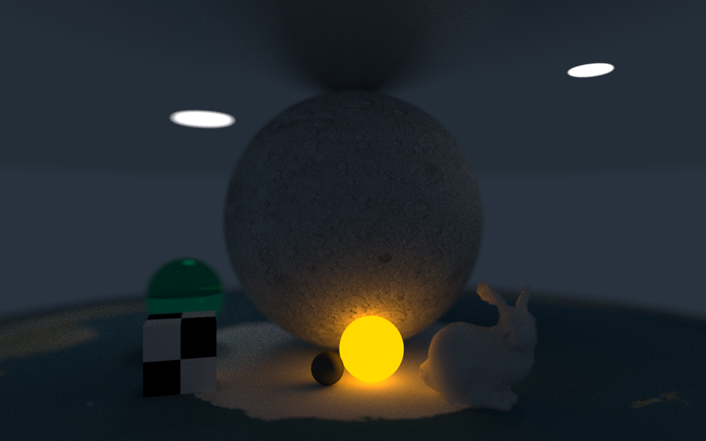

# rust-tracer
Raytracer in a weekend tutorial implementation on Rust language. 
It has some additional features such as mesh rendering. 
This is purely self-educational project and nothing more. 
Feel free to fork or borrow any code from this project. 
An example result of work could be seen below (with resolution of 1280x800 pixels and 512spp)

